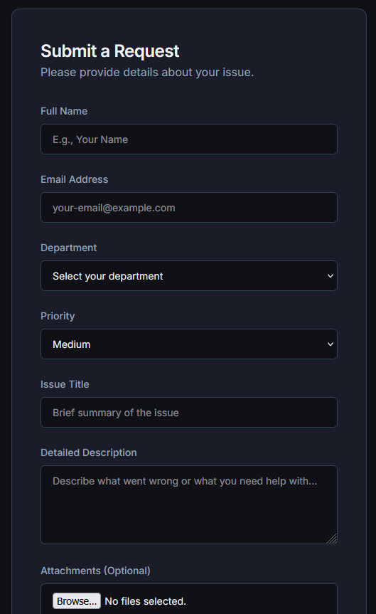
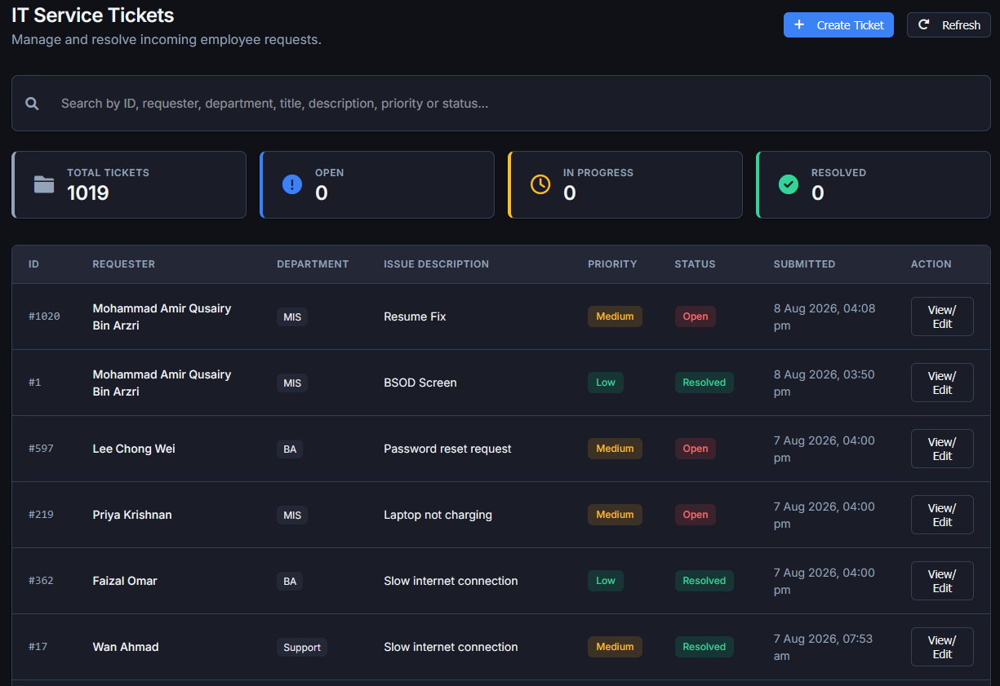

# Scarlet Curiosity - MIS Ticketing System

**Live Demo:** [Open Demo](https://mis-ticketing-demo.pages.dev)




A streamlined internal ticketing system for the MIS department, designed with a focus on simplicity, responsiveness, and clean UI design.



## Features
- **Public Ticket Submission:** Employees can easily submit IT requests with attachments.
- **Secure Status Tracking:** Users receive an email with a secure, unguessable link to track their ticket status in real-time.
- **Admin Dashboard:** A secure interface for administrators to view, manage, and update tickets.
- **Dark Mode Support:** A fully functional light/dark theme toggle for optimal viewing.
- **Email Notifications:** Automated SMTP notifications using SmarterMail when tickets are created.

## Tech Stack
- **Frontend:** HTML, Vanilla CSS (adhering to strict anti-slop design rules), JavaScript.
- **Backend:** Node.js, Express.js.
- **Database:** MySQL.
- **Authentication:** JWT (JSON Web Tokens).
- **File Uploads:** Multer.

## Setup Instructions
1. Clone the repository.
2. Run `npm install` to install dependencies.
3. Set up a MySQL database named `scarlet_curiosity`.
4. Create a `.env` file in the root directory and add the following variables:
   ```env
   DB_HOST=localhost
   DB_USER=root
   DB_PASS=
   DB_NAME=scarlet_curiosity
   JWT_SECRET=your_jwt_secret_key
   PORT=3000

   EMAIL_HOST=your_smtp_host
   EMAIL_PORT=587
   EMAIL_SECURE=false
   EMAIL_USER=your_email@domain.com
   EMAIL_PASS=your_email_password
   ```
5. Run `node seed.js` to create the tables and a default admin user.
   - *Default Admin Username:* `administrator`
   - *Default Admin Password:* `misdashboard9090`
6. Run `npm start` to launch the server on port 3000.

## License
MIT
